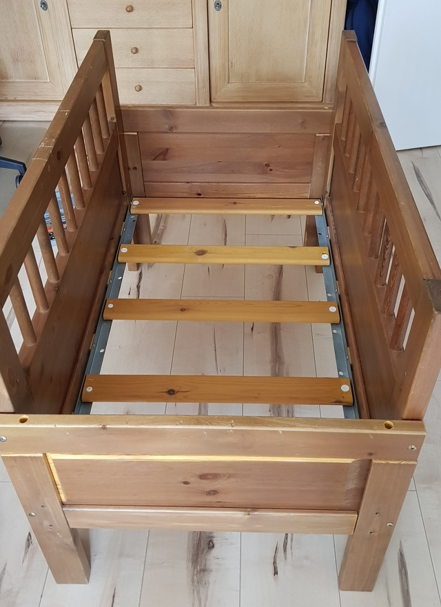
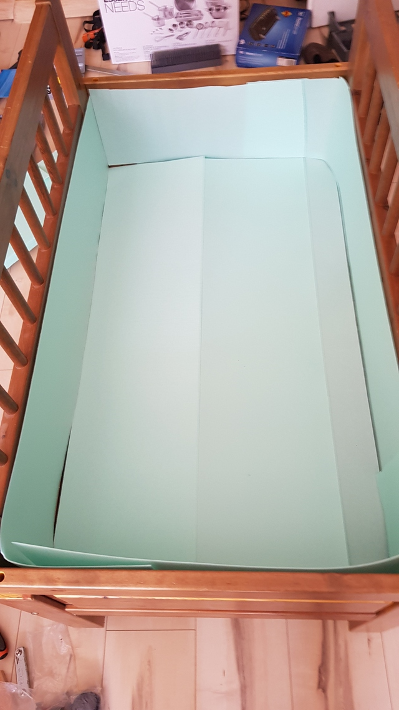
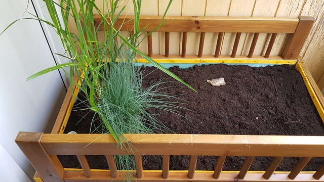

# Bett-Beet oder Beet-Bett?

Wie ein altes Etagenbett eine neue Bestimmung fand. Im Community-Projekt in Make 3/23 beschreibt unser Autor Roman Zajonz, wie er aus einem alten Bett ein schickes Hochbeet für den Balkon gemacht hat. Hier nun ein paar Detail-Fotos mehr. In dem Ordner Hires befinden sich die hochaufgelösten Fotos falls Sie genau hinschauen möchten.

Von den vorhandenen Bettteilen wurden die Eckwinkel und Teile des Lattenrostes nach Behandlung mit Holzgel gegen Feuchtigkeit angepasst. Alles wurde mit vorhandenen Schrauben verschraubt.

Die Grundplatte mit Bohrungen für den Wasserablauf, auf der alles ruht.

Auf der Grundplatte befindet sich ein Edelstahlnetz, das nach der Theorie (die vielleicht nicht funktioniert) dem Holz das „Atmen“ ermöglichen und eventuell vorhandenes Kondenswasser oder Wasserrückstände durch die Löcher in der Grundplatte abfließen lassen.

Im Keller befanden sich noch Reste der Laminatbodenverlegung von früher, so dass die Trittschalldämmung als „kleine“ Wärmedämmung und Schutz für die nächste Schicht verwendet wurde.

Eine dicke stabile Folie als Wasserhalter (Dichtung).

Als Drainage wurde die schöne, aber leider viel Platz in Anspruch nehmende Diatechnik verwendet (die Dias wurden natürlich vorher digitalisiert).

Durch die installierten Räder bleibt das "Beetbett" mobil, um die gefühlt „tonnenschweren“ Rabatten zur Balkonreinigung zu bewegen.

Inzwischen ist es schon etwas bepflanzt, aber zwischen Drainage und Erde wurde noch Gartenfolie gelegt, so dass die Drainage frei von Erde und Wurzeln bleibt.

Bis zum Boden (Folie) wurde ein Rohr PG25 („Elektroinstallation“) eingezogen, um den Wasserstand in der Drainage zu kontrollieren und bei Überfüllung mit einer kleinen Handpumpe wieder auf die Beetoberfläche zu befördern (es geht nichts verloren). Die Abschlusskanten der Folie wurden mit feuchtigkeitsgeschützten Leisten am Beet verschraubt und rundum mit Blähton aufgefüllt, um einen direkten Kontakt zwischen Erde und Holzleisten zu vermeiden.

Nr.10 Die Bepflanzung.

Die unzähligen wertvollen Reste, z.B. die Leiter für das Oberbett und auch andere Konstruktionsteile, konnten als Kletterhilfe verwendet werden.

Nr.12 Das Beet-Bett ist fertig!

